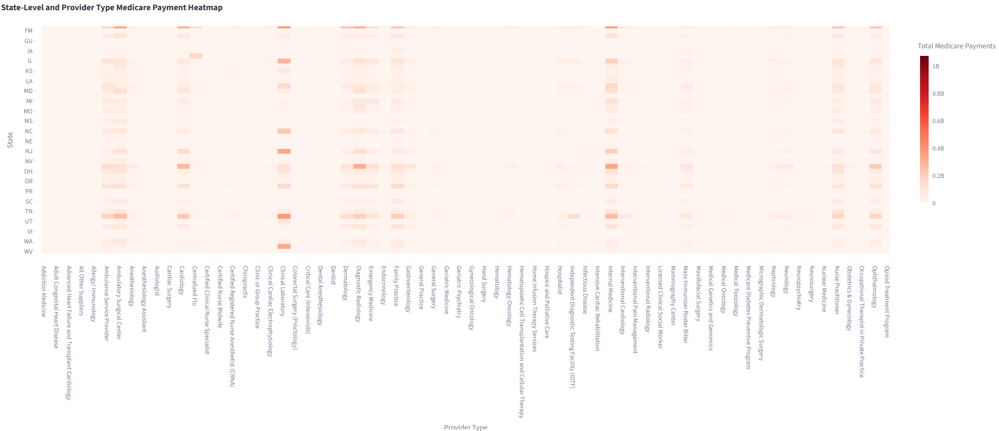

#											Healthcare Application

## Insights Summary
1. Significant variation exists in procedure utilization and medicare payments processed across states and providers, 
with volume differences of up to 30% observed between states and Ruca Codes for the same procedure. 
These insights enable healthcare executives to identify unwarranted variation, benchmark provider performance, 
optimize resource allocation, and inform strategic decisions related to network management and care delivery.
2. Cardiology, Internal Medicine, and Ophthalmology consistently bring high payment overall in most states.
Interestinly, certain states like Florida, Nevada, Texas show different behavior like high payments in dermatology,
diagnostic radiology, and ambuloatory surgical center. Better care can be provided on differences in patient behavior 
and needs in such states. (Take a look at the heatmap for more details)

### Data Used
The dataset used is from an API provided by CMS.
The Medicare Physician & Other Practitioners by Provider and Service dataset provides information on use, payments, 
and submitted charges organized by National Provider Identifier (NPI), Healthcare Common Procedure Coding System (HCPCS)
code, and place of service. This dataset is based on information gathered from CMS administrative claims data for 
Original Medicare Part B beneficiaries available from the CMS Chronic Conditions Data Warehouse.

###										Dashboard and Insights Charts

#### Provider and State Filters

#### Insights Summary #1

#### Insights Summary #2 State-Level and Provider Heatmap

### Architecture, systems design, and analytics

