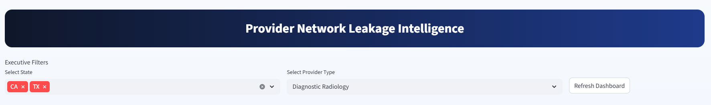
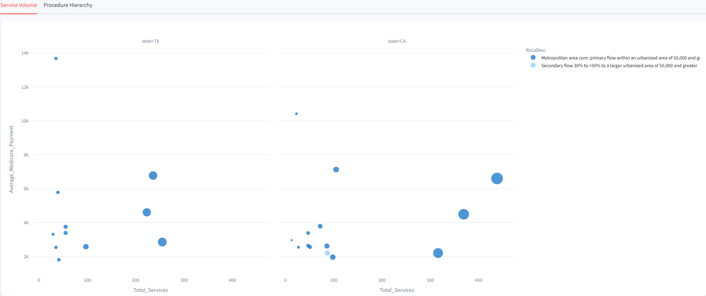
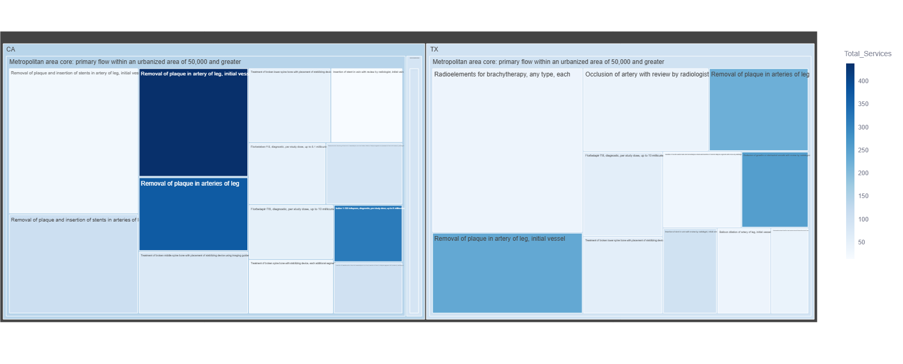
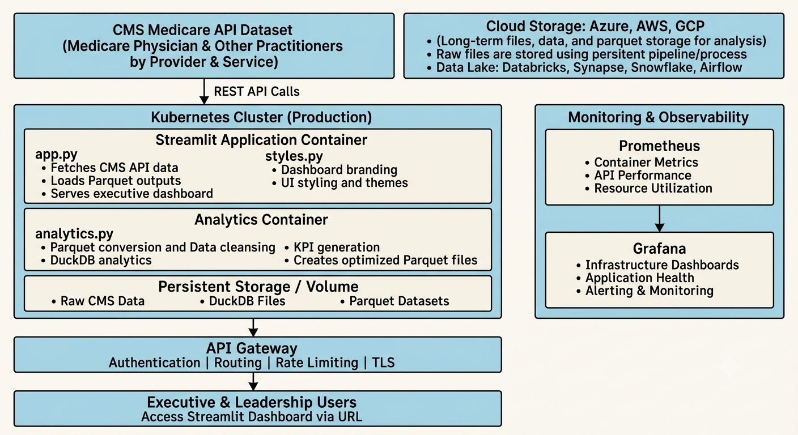

#											Healthcare Application

## Insights Summary
1. Significant variation exists in procedure utilization and medicare payments processed across states and providers, 
with volume differences of up to 30% observed between states and Ruca Codes for the same procedure. 
These insights enable healthcare executives to identify unwarranted variation, benchmark provider performance, 
optimize resource allocation, and inform strategic decisions related to network management and care delivery.

### Data Used
The dataset used is from an API provided by CMS.
The Medicare Physician & Other Practitioners by Provider and Service dataset provides information on use, payments, 
and submitted charges organized by National Provider Identifier (NPI), Healthcare Common Procedure Coding System (HCPCS)
code, and place of service. This dataset is based on information gathered from CMS administrative claims data for 
Original Medicare Part B beneficiaries available from the CMS Chronic Conditions Data Warehouse.

###										Dashboard and Insights Charts

#### Provider and State Filters

#### Insights Summary #1

### Architecture, systems design, and analytics

